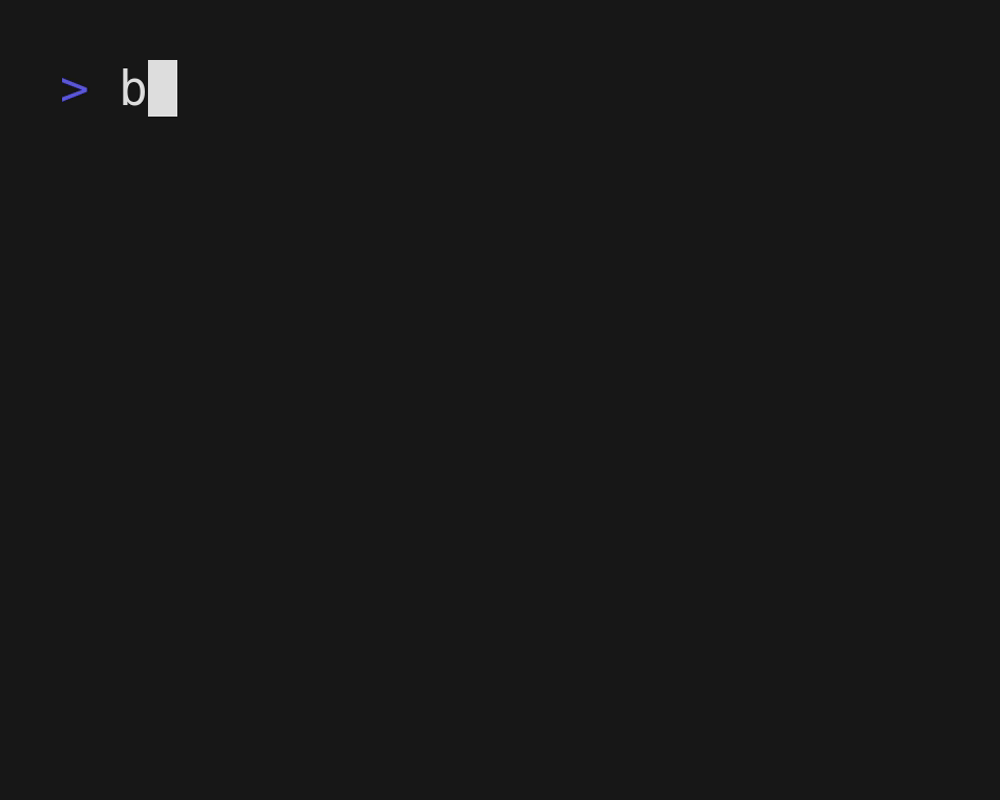

# BefEdit

A modal text editor for 2D languages, such as Befunge, ><>, or even ASCII art.



## Installation

Run `./install.sh` to build and install. The program can then be run with `befedit`

Alternatively, the `make` command will place the `befedit` binary in `./bin/befedit`.

## Usage

```sh
befedit file1 file2...
```

## How it Works

Movement is done with `h`, `j`, `k`, and `l` or arrow keys.
Unlike other editors, however, these also control a "momentum" vector.

When the editor opens, the momentum is set to `right`. If the movement key disagrees with the
momentum, it changes the momentum to that direction. If it does agree, the cursor will move.

In insert mode, as you type, your cursor will move according to the
momentum. `esc` brings you back to normal mode.

## Normal Mode actions

 - `i` - enter insert mode at current character
 - `a` - enter insert mode after current character
 - `I` - enter insert mode at start of line
 - `A` - enter insert mode at end of line
 - `.` - redo previous action (unlike other editors, movement does NOT count as an action)
 - `u` - undo previous action
 - `U` - redo undid action
 - `^` - jump to start of line
 - `$` - jump to end of line
 - `v` - enter select mode
 - `p` - paste yanked selection (rotates according to momentum)

Example of `.`:

The keystroke `itext<esc>j.` would produce

```
textt
    e
    x
    t
```

Note that "start of line" and "end of line" refer to the first and last locations of non-whitespace
characters in the current vertical or horizontal line.

The current momentum vector will point away from the start of the line and towards the end of the
line. The orientation of the line is defined based on this.

## Select mode interactions

 - hjkl and arrow keys - move around (no momentum involved)
 - `y` - yank a selection
 - `<esc>` - exit select mode

### Why does it think the buffer is modified after undoing everything?

Occasionally, the editor will add spaces in addition to the characters you type as scaffolding to
put your characters in the correct positions.

`undo`, however, does not remove these spaces.

For safety, the only time a buffer will count as unmodified is if it's been written with `:w` or
if it's been unmodified since opening.

## Commands

`:` enters command mode. The following commands are currently supported:

 - `q` - close buffer (won't work with unsaved changes)
 - `q!` - close buffer without saving
 - `wq` - save and close buffer
 - `x` - save and close buffer
 - `w` - save buffer
 - `n` - next buffer

