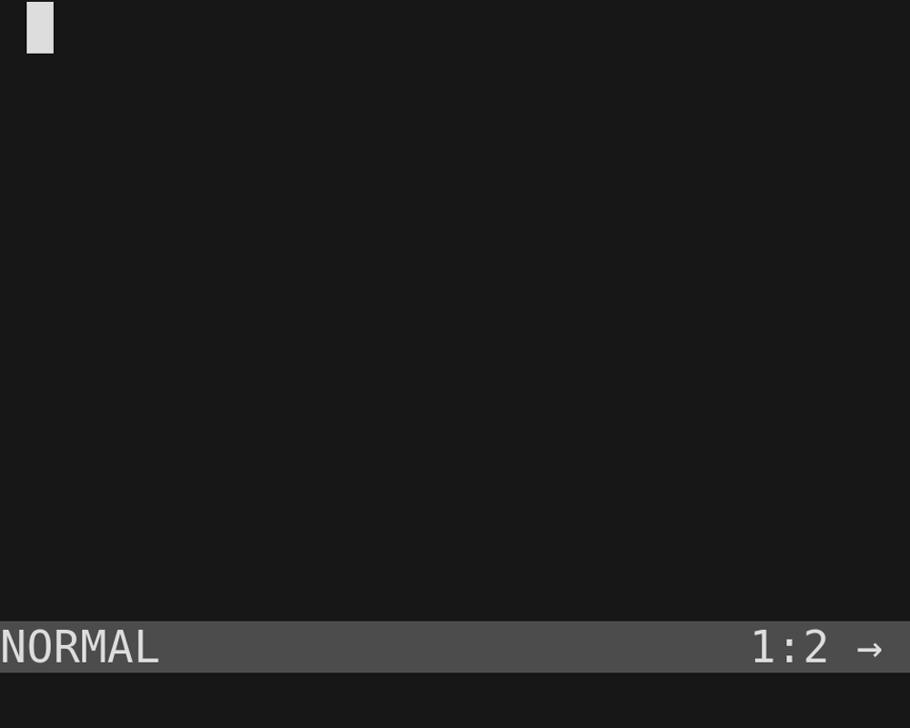
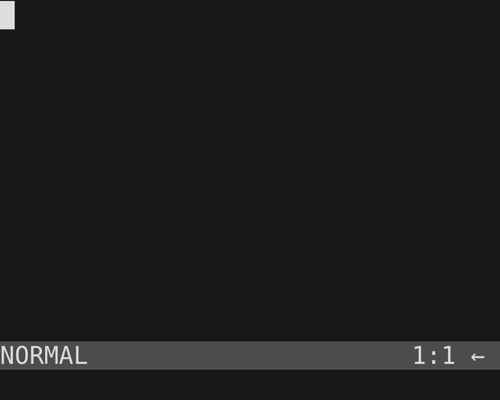
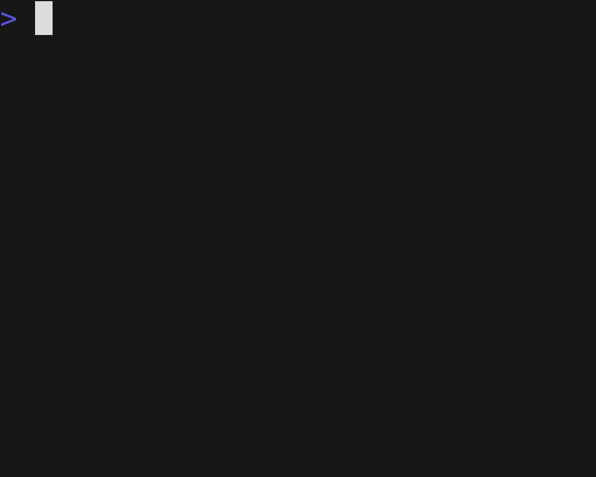

# BefEdit

A modal text editor for 2D languages, such as Befunge, ><>, or even ASCII art.

Basic directional usage


Copy/paste feature



Example of writing a Befunge-98 program that prompts for a decimal number, then prints it
out in binary followed by a new line. (Assumes BASE fingerprint support)



Befunge-98 config


## Installation

Run `./install.sh` to build and install. The program can then be run with `befedit`

Alternatively, the `make` command will place the `befedit` binary in `./bin/befedit`.

## Usage

```sh
befedit file1 file2...
```

## How it Works

Movement is done with `h`, `j`, `k`, and `l` or arrow keys.
Unlike other editors, however, these also control a "momentum" vector.

When the editor opens, the momentum is set to `right`. If the movement key disagrees with the
momentum, it changes the momentum to that direction. If it does agree, the cursor will move.

In insert mode, as you type, your cursor will move according to the
momentum. `esc` brings you back to normal mode.

While in insert mode, if you hit the left or top of the screen, it will add whitespace to the file
for your cursor to move to these positions.

## Normal Mode actions

| Action | Description                                                                        |
| :----: | :--------------------------------------------------------------------------------- |
| `i`    | enter insert mode at current character                                             |
| `a`    | enter insert mode after current character                                          |
| `I`    | enter insert mode at start of line                                                 |
| `A`    | enter insert mode at end of line                                                   |
| `.`    | redo previous action (unlike other editors, movement does NOT count as an action)  |
| `u`    | undo previous action                                                               |
| `U`    | redo undid action                                                                  |
| `^`    | jump to start of line                                                              |
| `$`    | jump to end of line                                                                |
| `v`    | enter select mode                                                                  |
| `p`    | paste yanked selection (rotates according to momentum)                             |
| `d`    | delete current character                                                           |
| `y`    | copy (yank) current character                                                      |
| `r`    | replace a character                                                                |

Example of `.`:

The keystroke `itext<esc>j.` would produce

```
textt
    e
    x
    t
```

Note that "start of line" and "end of line" refer to the first and last locations of non-whitespace
characters in the current vertical or horizontal line.

The current momentum vector will point away from the start of the line and towards the end of the
line. The orientation of the line is defined based on this.

## Select mode interactions

 - hjkl and arrow keys - move around (instantly updates movement and momentum, although the momentum
only matters once select mode is exit)
 - `y` - yank a selection
 - `d` - delete a selection
 - `<esc>` - exit select mode

### Why does it think the buffer is modified after undoing everything?

Occasionally, the editor will add spaces in addition to the characters you type as scaffolding to
put your characters in the correct positions.

`undo`, however, does not remove these spaces.

For safety, the only time a buffer will count as unmodified is if it's been written with `:w` or
if it's been unmodified since opening.

## Commands

`:` enters command mode. The following commands are currently supported:

| Command            | Shorthand | Description                   |
| :----------------- | :-------- | :---------------------------- |
| quit               | q         | close buffer                  |
| quit!              | q!        | close buffer w/o saving       |
| quit-all           | qa        | close all buffers             |
| quit-all!          | qa!       | close all buffers w/o saving  |
| write              | w         | save buffer                   |
| write-all          | wa        | save all buffers              |
| write-quit         | wq        | save and close buffer         |
| write-quit         | x         | save and close buffer         |
| write-quit-all     | wqa       | save and close all buffers    |
| next               | n         | next buffer                   |
| clean-whitespace   | cw        | remove unnecessary whitespace |
| open \<file>       | o \<file> | open a new buffer             |
| config-open        |           | open config file              |
| config-reload      |           | reload config                 |

## Configuration

The config file is written in Befunge-98 and located at `~/.config/befedit/config.b98`.

At load time, the config file willl be interpreted and the output will be printed as a status
message.

If it takes > 2 sec to run the config program, it will give up.

The Befunge-98 interpreter used is the [SBI interpreter](https://github.com/alec-kingsley/sbi),
with handprint `0x534249`, with the following additional fingerprint:

### `BFDT` fingerprint

`C` - pops a letter (we'll call this `x`), then pops values until it reaches a 0.

These values are saved as a keystroke, and `ctrl-{x}` will execute that keystroke.

In addition to characters, the following values may be used for special keys:

```
27  - ESC
127 - BACKSPACE
256 - LEFT ARROW
257 - RIGHT ARROW
258 - UP ARROW
259 - DOWN ARROW
260 - DEL
261 - HOME
262 - END
263 - PAGE UP
264 - PAGE DOWN
```

For example, if you would like `ctrl-s` to save your current buffer, you could use the following
config file:

```
"TDFB"4(  ;load befedit fingerprint; v
v *93 ":w" a 0                       <
  ^^^      ^
    |      |
    |      +--- enter
    +-- esc

> 'SC ; set to ctrl-s ; @
 ```

Or, more consisely:

`"TDFB"4(0a"w:"39*'SC@`

If `x` is not a letter, `C` will reflect. If `x` is 'J' or 'M', it will not reflect, however the
macro will do nothing.

`x` can be upper or lower case.


